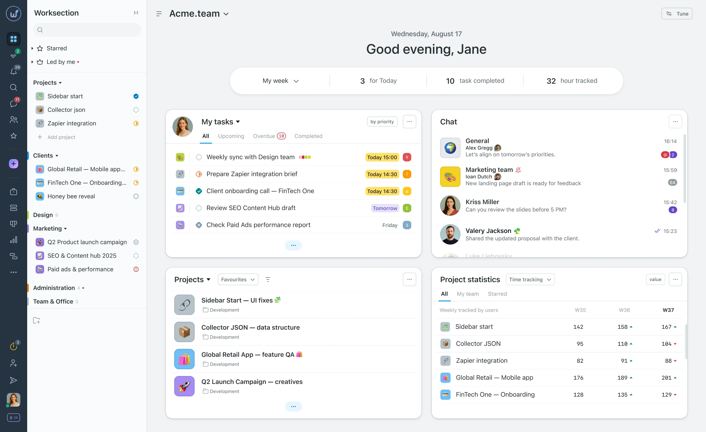
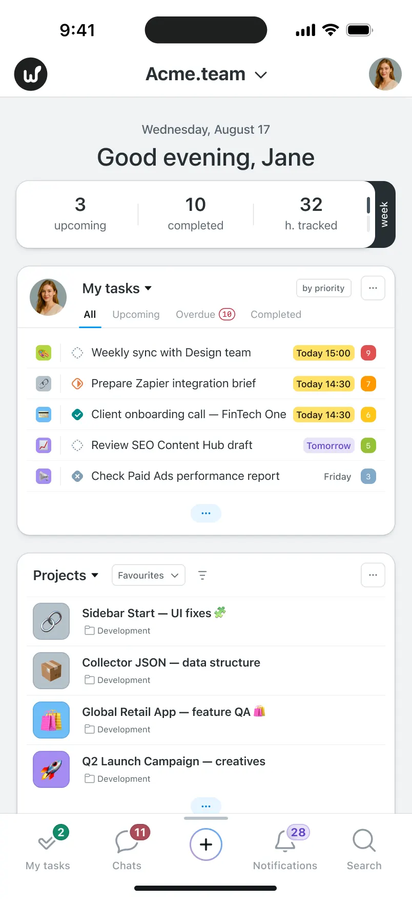

# Hero

Хіро-секція промосайту: заголовок, CTA, вкладки з екранами продукту і два скріншоти (десктоп + телефон). На широких екранах десктопний скріншот лежить у рамці, телефон перекриває його правий край, як у Figma. На вузьких (< 640 px) обидва скріншоти живуть у сцені фіксованої висоти, а тап по маленькому робить його головним. Свап анімується лише через `transform`, тому йде на композиторі й не смикає лейаут. Без залежностей, без збірки.

## Файли

| Файл | Що це |
|---|---|
| `hero.css` | увесь блок: типографіка, вкладки, обидві композиції скріншотів, анімація свапу |
| `hero.js` | контролер `Hero`: вкладки, стрілки, тап по мініатюрі. ~2 KB gzip з коментарями, ~1 KB мініфікований |
| `img/` | скріншоти Dashboard для демо (WebP) |
| `demo.html` | приклад підключення |
| `playground.js` | опис для плейграунду: контроли, пресети, сніпет. На сайт не потрібен |

На сайт беруть `hero.css` + `hero.js` + власну розмітку і скріншоти. Плейграунд: `../index.html`, вкладка «S : Hero».

## Підключення

Розмітка живе в HTML (це контентна секція, H1 має бути в документі, а не в JS). Повний приклад у `demo.html`, скорочено:

```html
<link rel="stylesheet" href="hero.css">

<section class="hero" id="hero">
  <div class="hero__inner">
    <div class="hero__head">
      <a class="hero__badge" href="#"><svg>…</svg><span>Worksection 2.0 доступний кожному! <u>Дізнатися більше</u></span></a>
      <h1 class="hero__title">Project management built <br>for teams, not just tasks</h1>
      <p class="hero__lead">We believe in teamocracy…</p>
      <div class="hero__cta">
        <a class="hero__btn hero__btn--primary" href="#">Get started</a>
        <a class="hero__btn" href="#">Contact sales</a>
      </div>
      <p class="hero__note">14 day trial, no credit card required</p>
    </div>
    <div class="hero__view">
      <div class="hero__tabs">
        <button type="button" class="hero__arrow hero__arrow--prev" aria-label="Previous view">…</button>
        <div class="hero__tablist" role="tablist">
          <button type="button" class="hero__tab" role="tab" aria-selected="true"
                  data-desktop="img/dashboard.webp" data-phone="img/dashboard-phone.webp"><svg>…</svg>Dashboard</button>
          <button type="button" class="hero__tab" role="tab" aria-selected="false"
                  data-desktop="img/tasks.webp" data-phone="img/tasks-phone.webp"><svg>…</svg>Tasks</button>
          …
        </div>
        <button type="button" class="hero__arrow hero__arrow--next" aria-label="Next view">…</button>
      </div>
      <div class="hero__screens" data-main="desktop">
        <button type="button" class="hero__screen hero__screen--desktop" data-screen="desktop" aria-label="Show the desktop version">
          
        </button>
        <button type="button" class="hero__screen hero__screen--phone" data-screen="phone" aria-label="Show the mobile version">
          
        </button>
      </div>
    </div>
  </div>
</section>

<script src="hero.js"></script>
<script>
  new Hero('#hero');
</script>
```

Що важливо в розмітці:

- кожна вкладка несе свою пару скріншотів у `data-desktop` / `data-phone`, за потреби ще `data-desktop-srcset` / `data-phone-srcset`. Вкладка без них лишає поточні картинки;
- `sizes` живе на самому `` і не міняється. У демо десктопний скрін має варіант 1280 px (60 KB замість 143): на телефоні він рендериться у ~560 CSS px, тож `sizes="(max-width: 639px) 140vw, 1280px"`;
- у `` потрібні `width` і `height` (реальні пікселі файлу): з них браузер знає пропорції до завантаження, і сцена не стрибає;
- `aria-selected="true"` на першій вкладці і `data-main="desktop"` на сцені: без JS блок теж рендериться правильно;
- замість `.hero__lead` можна покласти чек-лист `<ul class="hero__list"><li>…</li></ul>` (варіант із мобільного макета);
- `<br>` у заголовку на вузьких екранах ховається, тому перед ним потрібен пробіл.

## Як це працює

Брейкпоінти це container queries (`.hero` має `container-type: inline-size`), тож блок реагує на ширину, яку йому дали, а не на в'юпорт. Це й дозволяє дивитися мобільну версію в плейграунді, звузивши фрейм.

- **≥ 1280 px**: макет Figma для 1920. Рамка `max-width: 1280px`, телефон абсолютно спозиціонований у відсотках від рамки.
- **1024–1279 px**: менший заголовок, щільніші вкладки, щоб сім вкладок лишались в один ряд.
- **640–1023 px**: планшет, вкладки можуть переноситись на два ряди.
- **< 640 px**: вузька композиція. Вкладки показуються по одній зі стрілками. Сцена скріншотів `height: var(--hero-stage-h)`, обидва скріншоти `position: absolute`, розміри та позиції в `cqw` (1 % ширини блоку), тому композиція масштабується пропорційно на будь-якому телефоні.

Свап. Кожен скріншот верстається у своєму *головному* розмірі й позиції (`--hero-*-w/x/y`). Стан «мініатюра» це `transform: translate(…) scale(…)` поверх цього (`--hero-*-s/tx/ty`). Атрибут `data-main="desktop|phone"` на `.hero__screens` каже, хто зараз головний, CSS-перехід на `transform` робить решту. Тому:

- анімація тільки на композиторі, лейаут не перераховується;
- картинка ніколи не збільшується понад свій верстаний розмір, лише зменшується, тож лишається чіткою;
- телефон завжди зверху (він фізичний об’єкт над екраном). Коли головний телефон, десктоп не зменшується: він лишається у своєму розмірі, з’їжджає під телефон і стає по центру його вертикалі, з-під телефона видно ліву третину з сайдбаром. Тому z-index не перемикається і немає «стрибка» шарів наприкінці;
- той, що росте, їде з легким перельотом (`--hero-ease-grow`, опція `overshoot`), той, що зменшується, з плавним `--hero-ease`. Transition читає easing з нового стану, тож кожен бік бере свій;
- у польоті обидві картинки трохи нахиляються (`--hero-tilt`, телефон удвічі сильніше за десктоп), а під телефоном на півдорозі проступає додаткова тінь (опція `lift`). Це ключові кадри на `rotate` картинки і `opacity` псевдоелемента, поверх transform кнопки; композитор, без перемальовки. Вони гейтяться атрибутом `data-swapped`, який `hero.js` ставить при першому свапі, тож на завантаженні нічого не рухається;
- бейдж-підказка на мініатюрі контр-масштабується (`scale(1 / s)`), тому має постійний розмір; на десктоп-мініатюрі сидить зліва зверху, бо правий кут під телефоном.

`hero.js` не знає про брейкпоінти: `hero.css` ставить `--hero-swappable: 1` у вузькій композиції, а контролер читає це перед свапом. На широких екранах скріншоти декоративні (`pointer-events: none`).

## API

```js
const hero = new Hero('#hero', {
  view: 0,             // яка вкладка активна спочатку
  main: 'desktop',     // 'desktop' | 'phone': хто головний у вузькій композиції
  swap: true,          // тап по мініатюрі робить її головною
  hint: true,          // бейдж-підказка на мініатюрі
  duration: 600,       // ms, свап
  easing: 'cubic-bezier(.22, 1, .36, 1)',   // той, що зменшується
  overshoot: 0.2,      // переліт того, що росте: 0 = та сама крива, 0.4 = помітний відскок
  tilt: 3,             // deg, нахил у польоті; 0 = без нахилу
  lift: true,          // додаткова тінь під телефоном у польоті
  fade: 300,           // ms, кросфейд скріншота при зміні вкладки
});

hero.select(2);          // вкладка за індексом (з обгортанням)
hero.prev(); hero.next();
hero.show('phone');      // зробити телефон головним
hero.toggle();
hero.setOptions({ duration: 400 });
hero.destroy();
```

Події на корені: `hero:view` (`detail.index`) і `hero:main` (`detail.main`).

Клавіатура: стрілки ліворуч/праворуч у списку вкладок перемикають вкладки, Enter/Space на мініатюрі робить свап.

Дотик: горизонтальний свайп по сцені зі скріншотами перемикає вкладки (поріг 40 px, вертикальний скрол лишається нативним через `touch-action: pan-y`, миша не рахується). Після тапу по мініатюрі сцена підтягується у в’юпорт (`scrollIntoView`, `block: nearest`), бо телефон росте вниз. Картинки сусідніх вкладок підвантажуються в `requestIdleCallback`, тож наступний крок миттєвий.

## Змінні

Усе на `.hero`, перевизначайте у своєму CSS.

```css
.hero {
  /* тайпінг і кольори */
  --hero-font: "Inter", …;
  --hero-font-display: "Fixel Display", "Fixel Variable", var(--hero-font);
  --hero-bg: #eaebeb;
  --hero-accent: #b1c00c;          /* підкреслення активної вкладки, бейдж */
  --hero-accent-ink: #5a6204;

  /* рух (усе це пише hero.js з опцій) */
  --hero-swap: 600ms;
  --hero-ease: cubic-bezier(.22, 1, .36, 1);        /* той, що зменшується */
  --hero-ease-grow: cubic-bezier(.3, 1.2, .4, 1);   /* той, що росте */
  --hero-tilt: 3deg;
  --hero-fade: 300ms;

  /* вузька композиція, cqw. *-w/x/y: скрін як головний, *-s/tx/ty: він же як мініатюра */
  --hero-stage-h: 124cqw;
  --hero-desk-w: 139cqw;  --hero-desk-x: 5cqw;   --hero-desk-y: 0cqw;
  --hero-desk-s: 1;       --hero-desk-tx: 5cqw;  --hero-desk-ty: 14cqw;
  --hero-phone-w: 52cqw;  --hero-phone-x: 43cqw; --hero-phone-y: 0cqw;
  --hero-phone-s: .77;    --hero-phone-tx: 55cqw; --hero-phone-ty: 36cqw;
}
```

Значення за замовчуванням відштовхуються від мобільного макета Figma (402 px), а телефон більший (40 cqw замість 36) і нижчий, щоб майже половина його лежала на фоні секції, а не на білому скріншоті: так мініатюру видно краще. Композицію зручно підбирати в плейграунді, група «Композиція».

## Що ще варто знати

- Скріншоти в `img/` це WebP з Figma у 2x/3x плюс 1280 px варіант десктопа для телефонів. Телефонний скрін (804 px) на мобільному і так рендериться у ~210 CSS px, окремий варіант йому не потрібен.
- Заголовок на вузьких екранах флюїдний: `clamp(34px, 10.3cqw, 40px)`, тобто 34 px на 320 і 40 px (як у Figma) від 390.
- Ширина сцени у вузькій композиції дорівнює ширині блоку, а десктопний скріншот виходить за правий край: `.hero` має `overflow: clip`, тому горизонтального скролу не буде.
- `prefers-reduced-motion: reduce` вимикає переходи, свап стає миттєвим.
- Нижня частина макета (карусель відгуків, логотипи) до цього блоку не входить: логотипи це окремий модуль `logo-wall`.
